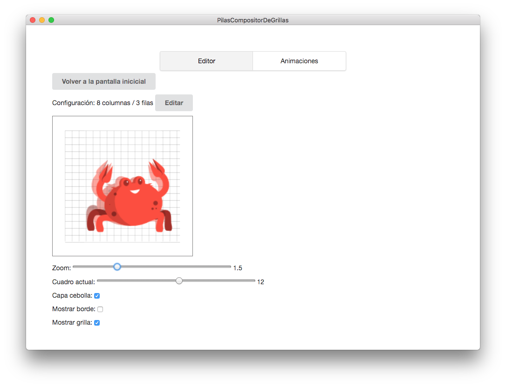

# Pilas Compositor De Grillas

[](https://travis-ci.org/pilas-engine/pilas-compositor-de-grillas)

Esta es una aplicación super sencilla pensada para probar
grillas de gráficos orientadas a pilas-engine.

## ¿En qué consiste?

Pilas usa un sistema de animación muy sencillo basado
en grillas de imágenes.

Las grillas generalmente se generan usando [un plugin
de gimp](http://losersjuegos.com.ar/software/gimp), pero una vez que se generan es algo difícil
de probar y corregir.

Esta aplicación permite previsualizar y corregir las grillas
directamente generadas:




Además, la aplicación visualiza cambios en la grilla en tiempo real, así que se puede editar el archivo de la grilla desde un editor externo y no hace falta reiniciar la aplicación para ver la nueva versión de la grilla.


## ¿Cómo usar la aplicación?

Las versiones compiladas de la aplicación están disponibles
en la sección releases de github, y publicamos versiones nuevas
con mucha frecuencia:

- https://github.com/pilas-engine/pilas-compositor-de-grillas/releases

Pero, si sos desarrollador, la mejor forma de iniciar la aplicación
es clonando el repositorio y ejecutando estos comandos:


```
npm install
bower install
ember electron
```

o simplemente usar `make` seguido de alguno de los comandos que
aparecen en pantalla:

```
make
```

(tal vez necesites ejecutar `npm install -g bower` y `npm install -g electron-cli` antes)
